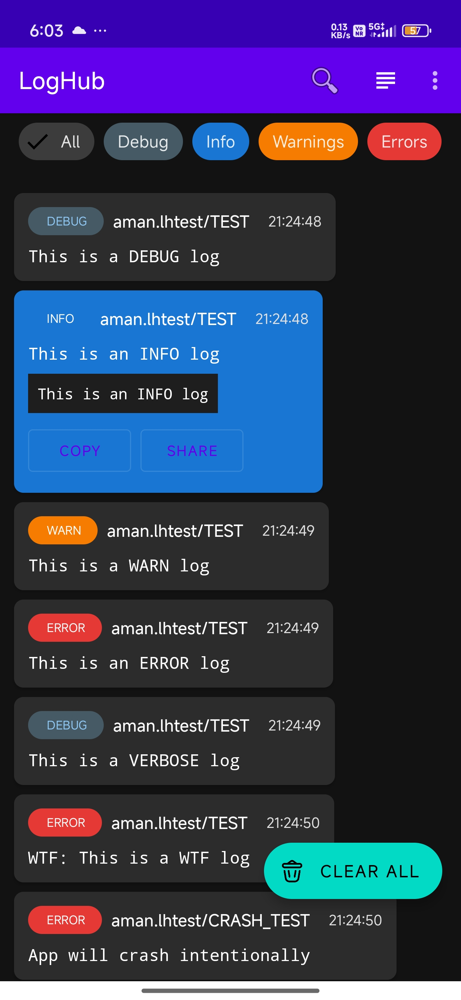
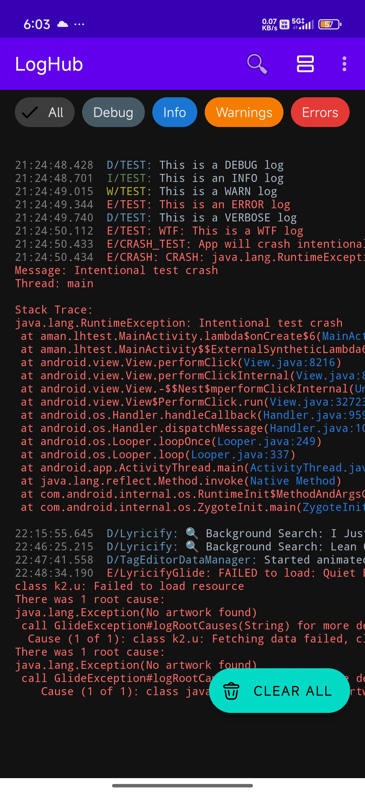

<p float="left">
  
   
</p>

# LogHub

Custom On-Device Logging Solution for Android.

## Usage

To use LogHub in your apps, copy the following `Log.java` file to your project and update the package name.

### 1. Update AndroidManifest.xml

Add the queries declaration and set the Application class:

```xml
<manifest>
    <queries>
        <provider android:authorities="aman.loghub.provider" />
    </queries>

    <application
        android:name=".Log"
        ...>
        ...
    </application>
</manifest>
```

### 2. Log.java

```java
package your.package.name;

import android.app.Application;
import android.content.ContentValues;
import android.content.Context;
import android.net.Uri;

public class Log extends Application {
    
    private static final Uri LOGHUB_URI = Uri.parse("content://aman.loghub.provider/logs");
    private static Context appContext;
    private static String appName;

    @Override
    public void onCreate() {
        super.onCreate();
        appContext = getApplicationContext();
        try {
            int stringId = getApplicationInfo().labelRes;
            appName = stringId == 0 ? getPackageName() : getString(stringId);
        } catch (Exception e) {
            appName = getPackageName();
        }
        Thread.setDefaultUncaughtExceptionHandler(new CrashHandler(this, appName));
    }

    public static void setAppName(String name) {
        appName = name;
    }

    public static int d(String tag, String msg) {
        int result = android.util.Log.d(tag, msg);
        sendToLogHub("DEBUG", tag, msg);
        return result;
    }

    public static int d(String tag, String msg, Throwable tr) {
        int result = android.util.Log.d(tag, msg, tr);
        sendToLogHub("DEBUG", tag, msg + "\n" + android.util.Log.getStackTraceString(tr));
        return result;
    }

    public static int i(String tag, String msg) {
        int result = android.util.Log.i(tag, msg);
        sendToLogHub("INFO", tag, msg);
        return result;
    }

    public static int i(String tag, String msg, Throwable tr) {
        int result = android.util.Log.i(tag, msg, tr);
        sendToLogHub("INFO", tag, msg + "\n" + android.util.Log.getStackTraceString(tr));
        return result;
    }

    public static int w(String tag, String msg) {
        int result = android.util.Log.w(tag, msg);
        sendToLogHub("WARN", tag, msg);
        return result;
    }

    public static int w(String tag, String msg, Throwable tr) {
        int result = android.util.Log.w(tag, msg, tr);
        sendToLogHub("WARN", tag, msg + "\n" + android.util.Log.getStackTraceString(tr));
        return result;
    }

    public static int w(String tag, Throwable tr) {
        int result = android.util.Log.w(tag, tr);
        sendToLogHub("WARN", tag, android.util.Log.getStackTraceString(tr));
        return result;
    }

    public static int e(String tag, String msg) {
        int result = android.util.Log.e(tag, msg);
        sendToLogHub("ERROR", tag, msg);
        return result;
    }

    public static int e(String tag, String msg, Throwable tr) {
        int result = android.util.Log.e(tag, msg, tr);
        sendToLogHub("ERROR", tag, msg + "\n" + android.util.Log.getStackTraceString(tr));
        return result;
    }

    public static int v(String tag, String msg) {
        int result = android.util.Log.v(tag, msg);
        sendToLogHub("DEBUG", tag, msg);
        return result;
    }

    public static int v(String tag, String msg, Throwable tr) {
        int result = android.util.Log.v(tag, msg, tr);
        sendToLogHub("DEBUG", tag, msg + "\n" + android.util.Log.getStackTraceString(tr));
        return result;
    }

    public static int wtf(String tag, String msg) {
        int result = android.util.Log.wtf(tag, msg);
        sendToLogHub("ERROR", tag, "WTF: " + msg);
        return result;
    }

    public static int wtf(String tag, Throwable tr) {
        int result = android.util.Log.wtf(tag, tr);
        sendToLogHub("ERROR", tag, "WTF: " + android.util.Log.getStackTraceString(tr));
        return result;
    }

    public static int wtf(String tag, String msg, Throwable tr) {
        int result = android.util.Log.wtf(tag, msg, tr);
        sendToLogHub("ERROR", tag, "WTF: " + msg + "\n" + android.util.Log.getStackTraceString(tr));
        return result;
    }

    public static String getStackTraceString(Throwable tr) {
        return android.util.Log.getStackTraceString(tr);
    }

    public static int println(int priority, String tag, String msg) {
        int result = android.util.Log.println(priority, tag, msg);
        String level = priorityToLevel(priority);
        sendToLogHub(level, tag, msg);
        return result;
    }

    public static boolean isLoggable(String tag, int level) {
        return android.util.Log.isLoggable(tag, level);
    }

    private static void sendToLogHub(String level, String tag, String msg) {
        if (appContext == null) return;
        new Thread(() -> {
            try {
                ContentValues v = new ContentValues();
                v.put("app_name", appName != null ? appName : "Unknown");
                v.put("tag", tag);
                v.put("message", msg);
                v.put("level", level);
                v.put("timestamp", System.currentTimeMillis());
                appContext.getContentResolver().insert(LOGHUB_URI, v);
            } catch (Exception e) {
            }
        }).start();
    }

    private static String priorityToLevel(int priority) {
        switch (priority) {
            case android.util.Log.VERBOSE:
            case android.util.Log.DEBUG:
                return "DEBUG";
            case android.util.Log.INFO:
                return "INFO";
            case android.util.Log.WARN:
                return "WARN";
            case android.util.Log.ERROR:
            case android.util.Log.ASSERT:
                return "ERROR";
            default:
                return "DEBUG";
        }
    }

    private static class CrashHandler implements Thread.UncaughtExceptionHandler {
        private Context context;
        private Thread.UncaughtExceptionHandler defaultHandler;
        private String appName;

        public CrashHandler(Context context, String appName) {
            this.context = context.getApplicationContext();
            this.appName = appName;
            this.defaultHandler = Thread.getDefaultUncaughtExceptionHandler();
        }

        @Override
        public void uncaughtException(Thread thread, Throwable throwable) {
            try {
                String crashLog = getCrashLog(thread, throwable);
                ContentValues v = new ContentValues();
                v.put("app_name", appName);
                v.put("tag", "CRASH");
                v.put("message", crashLog);
                v.put("level", "ERROR");
                v.put("timestamp", System.currentTimeMillis());
                context.getContentResolver().insert(LOGHUB_URI, v);
                Thread.sleep(100);
            } catch (Exception e) {
                android.util.Log.e("LogHub", "Failed to log crash", e);
            } finally {
                if (defaultHandler != null) {
                    defaultHandler.uncaughtException(thread, throwable);
                }
            }
        }

        private String getCrashLog(Thread thread, Throwable throwable) {
            StringBuilder sb = new StringBuilder();
            sb.append("CRASH: ").append(throwable.getClass().getName()).append("\n");
            sb.append("Message: ").append(throwable.getMessage()).append("\n");
            sb.append("Thread: ").append(thread.getName()).append("\n\n");
            sb.append("Stack Trace:\n");
            sb.append(android.util.Log.getStackTraceString(throwable));
            return sb.toString();
        }
    }
}
```